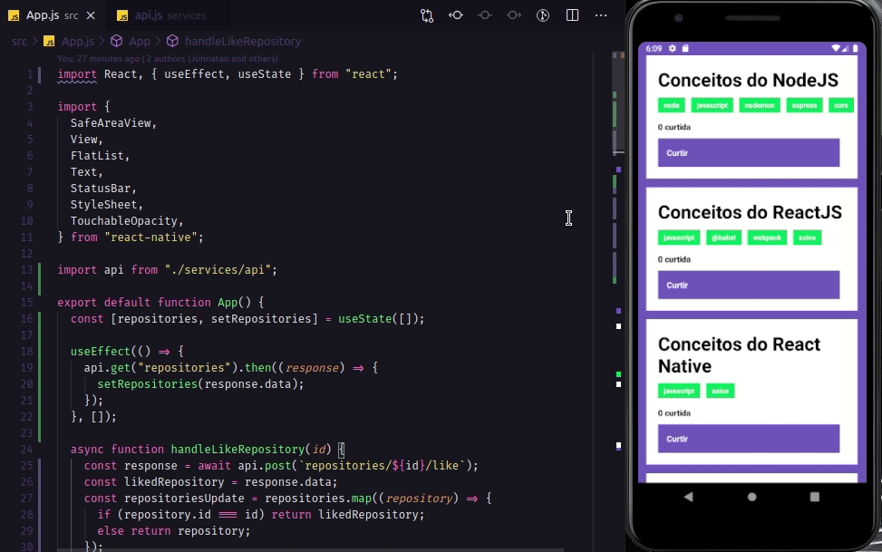

<h2 align="center"><a href="https://rocketseat.com.br/" target="_blank" style="text-decoration: none">
    
    <br>
    Desafio 01 do Bootcamp GoStack
    <br>
    Introdução ao ReactJS
</a></h2>

<div>
  
</div>

## Descrição

- Este projeto foi desenvolvido com a finalidade de cumprir o desafio 03 do Bootacamp GoStack da [Rocketseat](https://rocketseat.com.br/), utilizando o <strong>[ReactNative](https://reactnative.dev/)</strong> para fins de capacitação pessoal.
- A finalidade desse projeto é conectar o projeto mobile ao back-end e listar os Repositórios com as Tecnologias de um DEV e dar likes para esses dados.

## Etapas

- Para cumprir o desafio foram utilizadas e configuradas as rotas http GET, POST e DELETE.

```bash
* GET: Buscar informações do back-end;
* POST: Criar uma informação no back-end;
```

- Para dar likes em um repositório foi utilizado o método http POST para a rota "repositories/\${id}/like".

- Para listar os dados cadastrados foi utilizado o método http GET para a rota "/repositories".

## Tecnologias

- [React Native](https://reactnative.dev/)
- [yarn](https://yarnpkg.com/)
- [Android Studio](https://developer.android.com/studio)
- [Axios](https://github.com/axios/axios)

---

Desenvolvido por [Johnatan Luiz Osterloh](https://www.linkedin.com/in/johnatanosterloh/)
